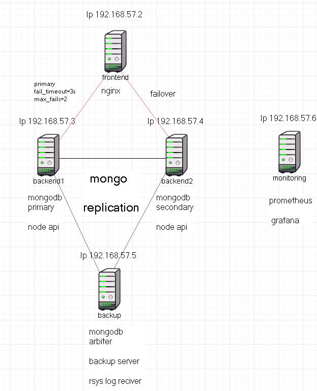

# Проект. Веб приложение sports-helper

## 1. Подготовка локальной среды

Подымаем тестовый контур через docker compose

```bash
docker compose up
```

Проверим корректность работы зайдя на <http://localhost:3000>  
Если все поднялось, создаём папку build командой,  
это необходимо для дальнейшего создания prod:  

выполним команду

```bash
docker compose exec frontend npm run build
```

Для удаления контейнеров используется команда:  

```bash
docker compose down -v
```

## 2. Описание веб приложения sports-helper ( режим разработчика )

Для работы приложения sports-helper необходимы:

- frontend на rectjs
- backend на nodejs
- mongodb

### 2.1 Frontend

Папка client:

```txt
 client
│   ├── babel-plugin-macros.config.js
│   ├── build
│   ├── Dockerfile
│   ├── jsconfig.json
│   ├── node_modules
│   ├── package.json
│   ├── package-lock.json
│   ├── public
│   ├── README.md
│   └── src
```

- package.json - основной json файл для установки пакетов для node. Также в этом файле указаны параметры запуска нашего приложения.

```js
 "proxy": "http://api:4200",
  "scripts": {
    "start": "react-scripts start",
    "build": "react-scripts build",
    "test": "react-scripts test",
    "eject": "react-scripts eject"
  }
```

proxy": "<http://api:4200>", `api` это имя контейнера с бэкендом
"start": "react-scripts start", скрипт старта приложения в dev среде. Располагаются в папке node_modules ( в контейнере )
"build": "react-scripts build", скрипт для создания папки build для prod среды.

- package-lock.json json файл для фиксации версий зависимостей.
- папка build это рабочий код приложения, папка создаётся при запуске команды `docker compose exec frontend npm run build`.
  данна папка копируется на сервер nginx.
- папка node modules пустая папка, эта папка куда инсталируются пакеты npm ( у нас она существует внутри контейнера frontend )
- Dockerfile - файл для создания контейнера frontend.  
 [Dockerfile](./client/Dockerfile)
- папка public - содержит index.html и картинки
- папка src содержит js код приложения

### 2.2 Backend

Папка server:

```txt
├── server
│   ├── controllers
│   ├── core
│   ├── Dockerfile
│   ├── models
│   ├── node_modules
│   ├── package.json
│   ├── package-lock.json
│   ├── server.ts
│   ├── tsconfig.json
│   ├── utils
│   └── yarn.lock
|   └── .env
```

- package.json основной файл для запуска api backend.

```js
 "scripts": {
    "start": "ts-node server.ts",
    "dev": "ts-node server.ts"
  },
```

- server.ts - основой файл с кодом приложения, происходит вызов функций.
- папка node modules пустая папка, эта папка куда инсталируются пакеты npm ( у нас она существует внутри контейнера api )
- .env файл содержит переменные для запуска нашего приложения.
- Dockerfile - файл для создания контейнера api.
   [Dockerfile](./server/Dockerfile)

- server/core/db.ts - содержит параметры подключения backend к базе данных mongo.

### 2.3 Mongo

Для работы Backend необходим сервис mongodb не старше 5 ой версии.

### 2.4 Запуск сервиса в dev режиме

Сервис в dev режиме запускается с помощью docker compose.

```bash
docker compse up
```

Docker-compose:

```yml
version: '3.8'
services:
  frontend:
    build: ./client
    restart: always
    ports:
      - '3000:3000'
    depends_on:
      - api
    volumes:
     - frontend_node_modules:/app/node_modules
     - ./client:/app
    networks:
      - my_network
  api:
    build: ./server
    restart: always
    ports:
      - '4200:4200'
    depends_on:
      - mongo
    volumes:
     - api_node_modules:/app/node_modules
     - ./server:/app
    networks:
      - my_network
  mongo:
    image: mongo:5.0.23-rc0
    restart: always
    ports:
     - 8081:8081
    volumes:
     - mongo_data:/data/db
    networks:
      - my_network
  my_network:
    driver: bridge
    ipam:
      driver: default
      config:
        - subnet: 172.25.0.0/16        
volumes:
  mongo_data:
  frontend_node_modules:  
  api_node_modules:
```

Ссылка по которой будет доступно приложение:

<http://localhost:3000>

## 3. Запуск проекта в prod

### 3.1 Подготовим локальный компьютер

Запустим local.yml

```bash
ansible-playbook local.yml --ask-become
```

```yml
---
- import_playbook: ./local_playbooks/add_hosts.yml 
- import_playbook: ./local_playbooks/mongo_key.yml 
- import_playbook: ./local_playbooks/nginx_cert.yml
```

Будут выполнены действия на localhost:

- добавлены записи  в  /etc/hosts
- сгенерирован секретный ключ `mongo_key` необходимый для репликации серверов mongo
- сгененирован самоподписанный сертификат для сервера nginx

### 3.2 Запуск серверов

Подымаем все сервера:

```ruby
vagrant up
```

Схема работы нашего приложения:



После запуска всех сервисов приложение sports-helper будет доступно по адресу:

<https://sports-helper>

Мониторинг будет доступен по адресу:

<http://monitoring:3000>

Сервер prometheus будет доступн по адресу:

<http://monitoring:9090>

Логи располагаются на сервере backup.

Проверка существования логов:

```bash
cd ansible
ansible-playbook install.yml --tags=check-logs -l backup
```

Проверка существования бэкапов:

Бэкапы базы mongo располагаются на сервере backup:

```bash
cd ansible
ansible-playbook install.yml --tags=show-backups -l backup
```

На всех серверах запущена система безопасности selinux в режиме enforcing,  
а также запущен firewall.

### 3.3 Подробное описание серверов

Запуск всех серверов просиходит с помощью оркестратора vagrant, provisioning настроен с помощью ansible.
Каждый сервис описан с помощью ролец ansible,


